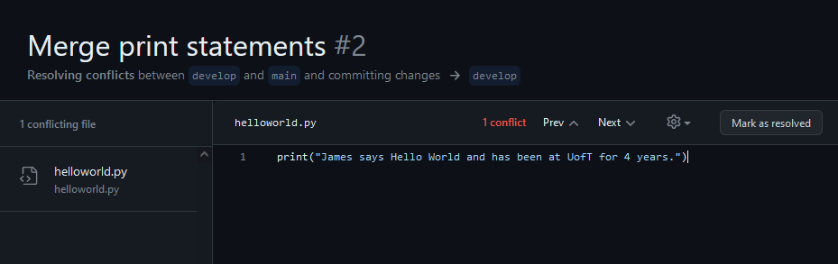

# James Xu

# A2 safety screenshot

- I am adding this with the Activity 5 commit for safety
- The instructions at the time I'm submitting this say
- > "Add a screenshot for the output of the merge command on the “main” branch. Commit and push the changes."
- Notably it does not say to put the screenshot in the README.md so in the commit ending activity 2, I placed the screenshot in the root directory but did not add it to the readme.
- I am going to put the screenshot here at the end anyways for clarity and because all the other screenshots are here, sorry if this is annoying.

# A3 Merge Screenshots

# A4 commits

# A5 rebased

- initially, c1->c2->c3->c4

- rebased interactively to c3->c4->c1->c2
